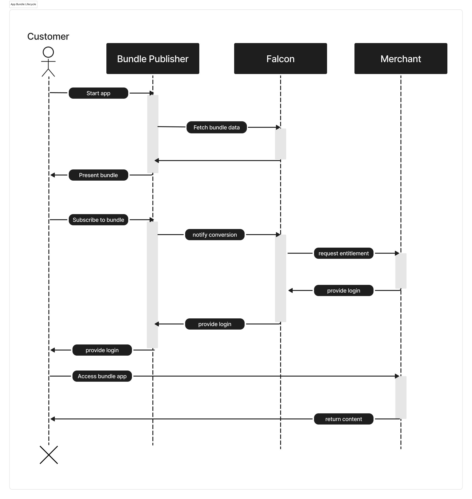

# Protocol Architecture & Lifecycle

::: tip What you will learn on this page
- Architecture of the falcon protocol
- LifeCycle of an app bundle
:::

## The Falcon Architecture

Falcon provides a centralized agentic backbone that standardizes an interface
for both merchants and resellers to interact with. Providing scalable bundling
across hundreds of thousands of market participants.

## The Lifecycle of a bundle application
The below diagram shows a standard bundle application onboarding lifecycle.
{data-zoomable}
