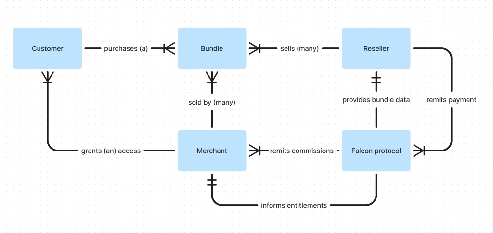

# Core concepts

In order to best use Falcon, it is recommended to first understand the core data model and lifecycle of an app bundle. 

::: tip What you will learn on this page
- Entities within an app bundle
- Relationships between entities
:::

## Entities
The following are the core entities within a bundle system

### Bundle
A bundle is two or more subscription apps that are packaged together and, in
most cases discounted to a unique price, that is created and sold by a bundle publisher.

### Consumer
The end consumer of the bundle. The consumer needs to be able to purchase a
bundle, manage their subscription and access the apps within the bundle. 

Falcon provides the consumer mapping bridge between all applications in a bundle
facilitating seamless access to all apps in the bundle. 

### Bundle Publisher
The bundle publisher is the entity the creates and sells bundle offerings to their consumer audience.

::: info 
The primary responsibility of the bundle publisher is to present the bundle to the end
consumer and in the case of a [super bundle](/bundle-modes) collect revenue for
the entire bundle and remit commission to the Falcon Protocol for further
distribution.
:::
### Merchant
The merchant is a subscription business that is offering their app as part of a
bundle. 

They setup their program terms via a Bundle contract terms, which can then be
accepted by bundle publishers.

::: info 
The primary responsibility of the merchant is to provision access to their app
via the entitlement API and manage their bundle contract terms onf the Falcon Protocol.
:::

### Bundle Contract
The bundle terms are programmatic contract terms that encodes the terms of the
partnership agreement between the bundle publisher and the merchant.

### Falcon broker
The Falcon broker is an agentic instance of the Falcon Protocol which provides
the bridge between the bundle publisher and the merchant.

It is responsible for:
1. Offering communication to the bundle publisher 
2. Entitlemenet management to the merchant
3. Bundle term enforcement and exeuction between bundle publisher and merchant

## Entity relationship

